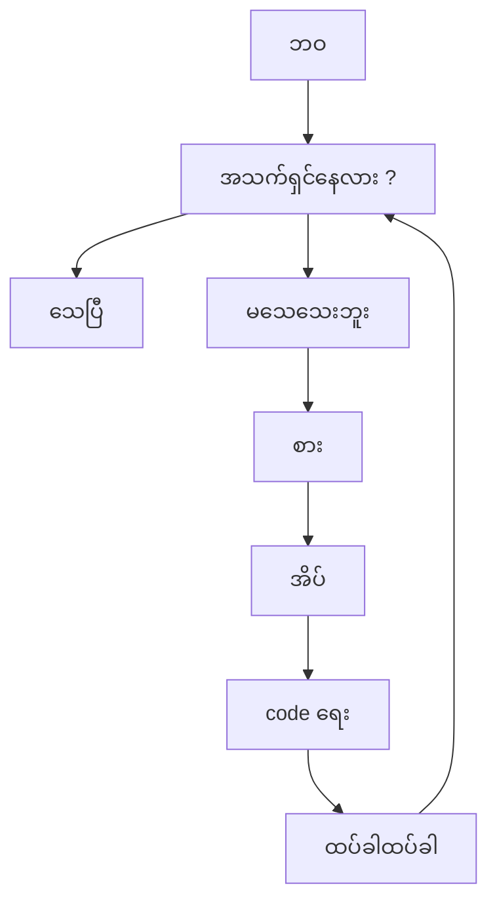

# funny_code

```mermaid
  graph TD;
    a1["ဘဝ"];
    b1["စား"];
    c1["အိပ်"];
    d1["code ရေး"]
    e1["ထပ်ခါထပ်ခါ"]
    f1["အသက်ရှင်နေလား ?"]
    g1["သေပြီ"]
    h1["မသေသေးဘူး"]

    a1 --> f1
    f1 --> h1
    f1 --> g1

    h1 --> b1
    b1 --> c1
    c1 --> d1
    d1 --> e1
    e1 --> f1
```
